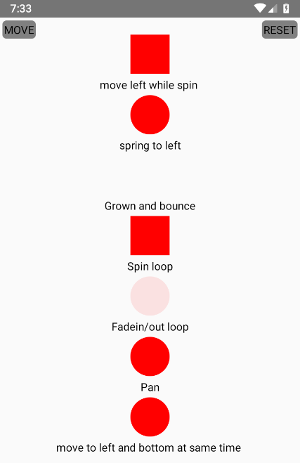

# React Native Basic Animations

## Install

Remove all and install new cli

```
# npm remove react-native-cli -g
# npm install @react-native-community/cli -g
```

## Create project

```
#  npx react-native init rnanimations
```

## Image



## Links sorces

- [Tutorial](https://www.youtube.com/watch?v=dXVgb3igGJ4&list=PLYxzS__5yYQmdfEyKDrlG5E0F0u7_iIUo) - Codedamn react animation
- [Doc](https://reactnative.dev/docs/animations) - React animaion official doc
- [Doc](https://easings.net/) - Easing functions
- [Doc](https://reactnative.dev/docs/panresponder) - Pan gesture

## Versions used

- node v10.13.0
- react-native cli 4.9.0
